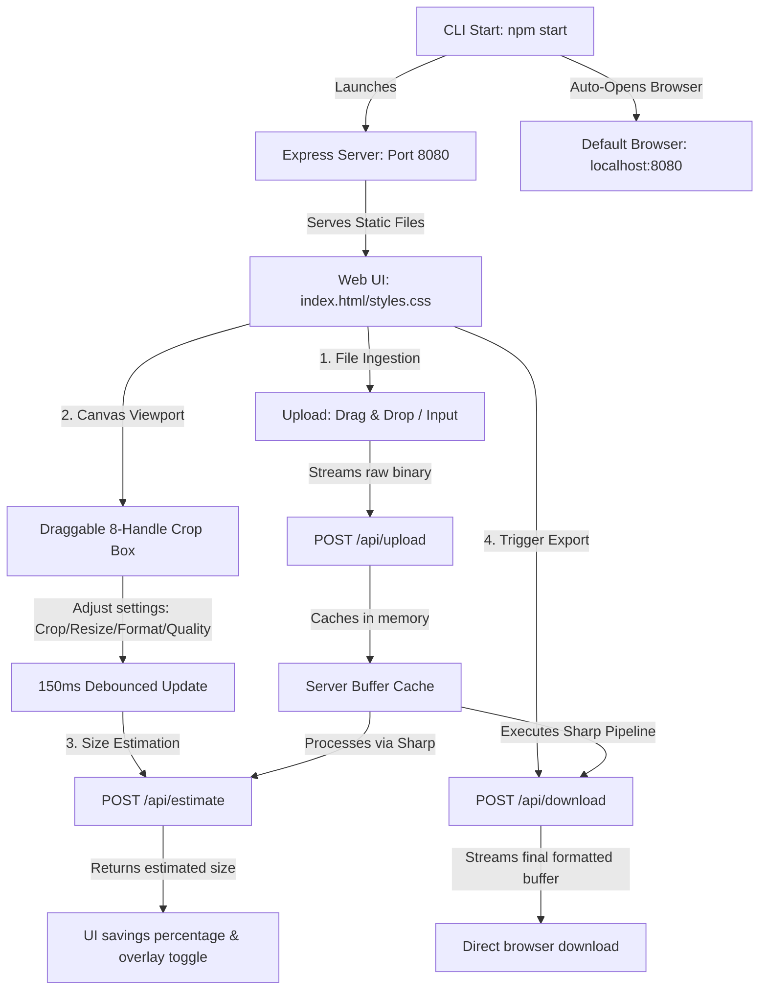

# OptiCrop // Advanced Image Studio

A premium CLI-driven web application to crop, resize, and compress images into multiple modern web formats.

## 1. Architecture & Design Plan

OptiCrop is built as a hybrid client-server application to balance client-side interactive rendering with high-performance server-side image encoding.



### Key Components

1. **CLI Launcher & Static Server (`server.js`)**
   - Configured as an ES Module running on Node.js.
   - Listens on port `8080` and uses the standard `open` package to automatically launch the default browser.
   - Handles raw image caching in-memory to prevent disk writing overhead.

2. **Frontend UI System (`public/`)**
   - **Rich Aesthetics**: Styled with a dark-mode obsidian glassmorphic card design, glowing accent borders, and animated background lights.
   - **Interactive Viewport**: Standard Canvas drawing fitted to wrapper dimensions, covered with an absolute crop overlay containing 8 interactive handles.
   - **Visual Feedback**: A circular gauge showing real-time compression ratio savings and a glassmorphic **"Applying changes..."** loader panel overlaying controls during estimation cycles.

3. **Backend Image Processor (`server.js` + `sharp`)**
   - Uses the high-performance `sharp` library to parse cached buffers, extract coordinates, resize dimensions, and format files.

---

## 2. File Layout

```
image-tool/
├── package.json          # Node dependencies & start script
├── server.js             # Express API routes, static server & open utility
├── README.md             # Project documentation (this file)
└── public/               # Frontend Editor Assets
    ├── index.html        # Glassmorphic editor workspace structure
    ├── styles.css        # Theme variables, neon glows & spinner transitions
    └── app.js            # Ingestion handlers, canvas mathematics & API links
```

---

## 3. Supported Formats & MIME Mappings

OptiCrop supports 6 distinct export formats. Lossy formats support visual compression quality adjustment, while lossless wrappers automatically hide quality options:

| Format Name | MIME Type | Quality Enabled | Output File Extension | Description |
| :--- | :--- | :---: | :---: | :--- |
| **JPEG** | `image/jpeg` | Yes | `.jpg` / `.jpeg` | Standard lossy compression format. |
| **PNG** | `image/png` | No | `.png` | Lossless graphic compression. |
| **GIF** | `image/gif` | No | `.gif` | Single frame static GIF output. |
| **WebP** | `image/webp` | Yes | `.webp` | High-efficiency modern web image. |
| **AVIF** | `image/avif` | Yes | `.avif` | Ultra-high compression next-gen format. |
| **TIFF** | `image/tiff` | Yes | `.tiff` | Uncompressed high-fidelity graphics. |

---

## 4. Operation Instructions

### Setup & Launch
1. Ensure Node.js (v18+) is installed on your machine.
2. In the root directory, install dependencies:
   ```bash
   npm install
   ```
3. Boot the CLI server:
   ```bash
   npm start
   ```
4. The terminal will log the server credentials and automatically open your default browser to `http://localhost:8080`.

### Core Workflow
- **Upload**: Drop any image on the upload area or click to select a file.
- **Crop**: Drag the corners or edges of the crop box. Select ratio presets (1:1, 4:3, 16:9) to lock proportions. Edge handles are hidden in locked aspect modes to ensure single-direction movements follow constraints.
- **Resize**: Toggle **Lock Ratio** and input custom pixels, or click the preset pills (25%, 50%, 75%, 100%) to scale the cropped boundary.
- **Optimize**: Toggle the format selectors and slide the quality scale. The UI will show a pulsing overlay (**"Applying changes..."**) and update the circular savings meter.
- **Download**: Click **Download Processed Image**. The button will display a spinning wheel and download the final crop when ready.
